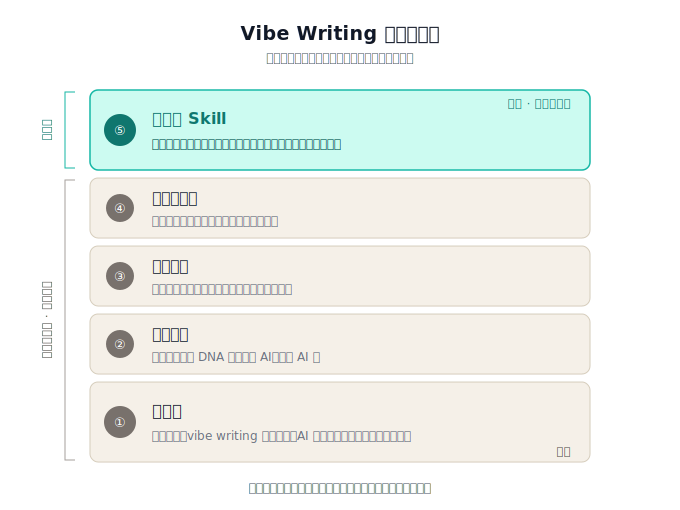

# Vibe Writing Skills

**[English](./README.en.md) | 中文**

把个人写作流程工程化的 Claude Code skill。AI 做查资料、核对、校对、引用整理；你只做选题、立论、判断、人设。

灵感来自《兄弟们，真·Vibe Writing 时代到来了》这篇文章的核心理念：**文章的魂是作者的，团队是 AI 的**。

## Vibe Writing 的五个要素

<p align="center">
  
</p>

前 4 层（原创力、个人风格、框架先行、流程工程化）是**作者理念**，谁都替代不了。第 5 层（可复用 Skill）是**工程放大器**，把前四者打包成一键触发的模板。本 repo 就是这第 5 层的一份公开实现。

## 这是什么

一套可复用、可追加的写作 skill，用 Claude Code 的 skill 机制加载。核心设计：

- **SKILL.md**：编排层，定义流程（收集素材 → 事实核查 → 扩写 → 自检 → 输出）
- **persona.md**：作者人设（身份、写作底色、硬性规则）
- **style.md**：语言、段落、数字、地域范围等风格规范
- **structure.md**：章节编号、案例、表格、结论要求
- **error-log.md**：错题本，append-only。每次反馈"别再 X"，追加一条，下次自动生效
- **output-format.md**：文章末尾的三节（作者其它文章 / 本文参考文献 / 附录：原始草稿）规范
- **references/images.md**：配图来源优先级
- **ARCHITECTURE.md**：整套设计的工程化方案和非目标

## 为什么这么拆

过去所有规则塞在一个 `SKILL.md` 里，改错题和改人设纠缠在一起，文件滚到 500 行谁也维护不了。拆开之后：

- 改错题 → 只动 `error-log.md`
- 改人设 → 只动 `persona.md`
- 每个文件单一职责，diff 清晰，可独立演化

所有文件在 skill 执行时都会被加载进上下文，token 成本和单文件一样。多文件是为了**维护者的认知负担**，不是为了省 token。

## 安装

### 在 Claude Code 项目里使用

```bash
# 在你的项目根目录
cd your-project
mkdir -p .claude/skills/write-article
cp -R /path/to/vibe-writing-skills/* .claude/skills/write-article/
```

**路径必须是 `.claude/skills/write-article/`**，因为 `SKILL.md` 的流程里用这个绝对路径读取配置文件。

然后在 Claude Code 里直接 `/write-article <草稿文件路径或主题>` 触发。

### 自定义

安装后，至少改三个文件变成你自己的：

1. **`persona.md`**：换成你的身份、写作底色、硬性规则
2. **`style.md`**：你的语言偏好、段落长度、数字格式、地域范围
3. **`structure.md`**：你的章节编号规范、案例要求

`error-log.md` 不用预先改。每次 Claude 写错东西，你反馈一句"别再 X"，追加一条到这个文件，下次自动规避。

`output-format.md` 视需要改文末三节（作者其它文章 / 本文参考文献 / 附录：原始草稿）的具体格式。

## 工作流程

```
你写草稿 (.md 文件)
   ↓
/write-article <草稿路径>
   ↓
Claude 自动：
  1. 加载配置（persona / style / structure / error-log / output-format）
  2. 收集素材（读你的草稿）
  3. 分析规划（定核心论点，划分章节）
  4. 事实核查（WebSearch 核对数字、时间、人名、事件）
  5. 扩写（按大纲补血肉，遵守所有配置文件的规则）
  6. 自检（对照 error-log 逐条检查）
  7. 输出（.md 文件 + 参考文献 + 原始草稿附录）
   ↓
你 review → 提反馈 → append 到 error-log → 下次更稳
```

## 设计原则

见 [ARCHITECTURE.md](./ARCHITECTURE.md)。简版：

- **单一职责**：每个文件只管一件事
- **显式导入**：SKILL.md 明确 Read 所有配套文件，不依赖隐式加载
- **独立演化**：错题本高频变化，人设几乎不动，物理分离
- **可追加优先**：错题本 append-only，降低写入阻力

## 不做什么

参考 ARCHITECTURE.md 的 "非目标" 一节。本 skill 明确不做：

- 多智能体编排（style-checker agent、reviewer agent）
- 写作前的 Document Spec / DoD 清单
- PDF 入库、AI 味检测 API
- Memory JSON 数据库

原因：单人博客的维护成本回本不了。

## License

MIT
